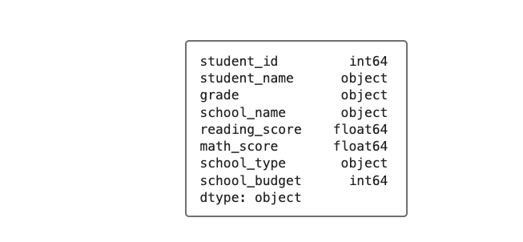
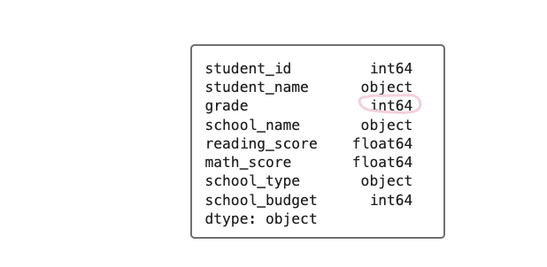
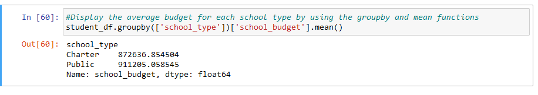

# School_District_Analysis
# PyCitySchools with Pandas

## Overview of Project
For this module, we were instructed to assist Maria, the chief data scientist for a city school district. Data containing student and school information was previously analyzed.  However, there was new data containing school budget information that had to be included in the original analysis. 

## Purpose
The purpose of this project is to rework part of the analysis using the new dataset.

## Results
To complete this challenge, student data had to be collected and imported into a DataFrame called student_df.  To confirm the data was correctly imported, a head function was used.  This data was then cleaned and prepared using a software library called pandas, the programming language called python, and the Jupyter Notebook. 

For this project, the data was first inspected and the data type in each column was checked using the dtypes function.  
Figure 1 shows the original data types found in the data columns. Notice that the grade column in Figure 1 is in the form of an "object" data type form.

### **Figure 1**

 To make the data more manageable to work with, this data type was changed to an "integer" form.  Focusing on the grade column in Figure 2, the "th" sufix was removed for every value in this column.  To do this, the str and replace functions were used. 

### **Figure 2**

 Figure 2 shows the new grade column circled in pink.  Comparing the grade column in Figure 1 and Figure 2, we can see the data type change from an "object" to "integer" form.

Once the data was properly formatted, it was then summarized by generating the summary statistics for the student DataFrame.  The data was then compared. A brief comparison of the data can be seen in Figure 3. 

### **Figure 3**

According to the data, there are two types of schools, one being a charter school and the other one being a public school. When comparing the average budget for the two types of schools, it can be infer that the public schools have a larger average budget than the charter schools.  Other data was also compared and submitted to this repository.

It should be noted that the order of the last three questions were in different order compared to the questions found in the module. 

## Summary
In summary, it was a bit confusing when the results from my code did not match the results in the module.  However, it all got sorted out in the end.  There was also a lot of data to sort through.  Along with the school funding information, both math and reading scores for all the students in the two different types of schools were provided and analyzed.  Overall, this project showed me the importance that data analysis tools have when it comes to understanding the trends in school performance.  Data analysis tools can also have a huge impact when it comes to making future strategic decisions at the school and district level.

